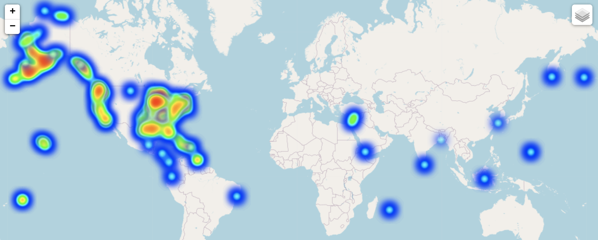

# ML-Based Marine Spill Detector


The proposal of the project is published in the NASA Space Apps challenge website. We propose an oil spill detection web application that periodically reads NASA satellite data and generates a global geographic heatmap. The purpose of the heatmap is to indicate the occurrence chance of the spillage incidents using regular deep learning methods. [continue reading](Proposal.md)

<br />
<br />
<br />


## Pre-Processed Data


| File  | Desc | Size | URL |
| ------------- | ------------- |------------- |------------- |
| SSS_02_metadata.csv  | Selected Data Listing | 8.64 MB | [Direct Download](https://www.dropbox.com/s/zoef50qn5rcnsdf/SSS_02_metadata.csv?dl=1) |
| SSS_02_raw.zip/time_samples.csv  | Cleaned Data Listing | 4.84 MB | [Direct Download](https://www.dropbox.com/s/oo52lhxypfvdmdb/SSS_02_raw_time_samples.csv?dl=1) |
| SSS_02_delta.zip/sample_pairs.csv  | Extracted Data Listing | 8.06 MB | [Direct Download](https://www.dropbox.com/s/24rghn8jl352cer/SSS_02_delta_sample_pairs.csv?dl=1) |
| SSS_02_raw.zip  | Cleaned Dataset  | 518.02 MB | [Direct Download](https://www.dropbox.com/s/jhz8uytpkty38n7/SSS_02_raw.zip?dl=1) |
| SSS_02_delta.zip  | Extracted Dataset  | 365.98 MB | [Direct Download](https://www.dropbox.com/s/t0diyq5y8onun77/SSS_02_delta.zip?dl=1) |

| Browse Spatial Distributions by Label | SSS_02_delta.zip Subsets by Type  |
| ------------- | ---------- |
| <a href="https://www.saudispaceshuttle.com/SSS_02"></a> |   | 
 [Explore more data details](/data)


<br />
<br />
<br />


## Training a Baseline Deep Learning Model

### 1. Prerequisites
I. [Conda Distribution of Python](https://docs.conda.io/en/latest/miniconda.html)
    
II. [GPU Version of TensorFlow](https://docs.anaconda.com/anaconda/user-guide/tasks/tensorflow/)
```
conda install -c anaconda tensorflow-gpu
```

III. [Extracted Samples of SSS_02](/data)

If you're using Linux, open the Terminal and enter:
 ```terminal
 wget "https://www.dropbox.com/s/t0diyq5y8onun77/SSS_02_delta.zip?dl=1"
 ```

### 2. Preparing Data Generators by TensorFlow

Data augmentation is a standard practice in imagery and big data and is available in the [ImageDataGenerator](https://www.tensorflow.org/api_docs/python/tf/keras/preprocessing/image/ImageDataGenerator) class.


```Python
import tensorflow as tf
from tensorflow.keras.preprocessing.image import ImageDataGenerator

dataset_directory = '/home/username/SSS_02_delta'
image_size = (100, 100)
batch_size = 50

gen = ImageDataGenerator(
    rescale=1./255.,
    horizontal_flip = True,
    vertical_flip = True,
    rotation_range = 5,
    height_shift_range = 2,
    width_shift_range = 2,
)

train_generator = gen.flow_from_directory(
    dataset_directory+'/train',
    target_size = image_size,
    batch_size = batch_size,
    class_mode = 'binary',
    color_mode = 'grayscale',
)

valid_generator = ImageDataGenerator(rescale=1./255.).flow_from_directory(
    dataset_directory+'/valid',
    target_size = image_size,
    batch_size = batch_size,
    class_mode = 'binary',
    color_mode = 'grayscale',
)
```


