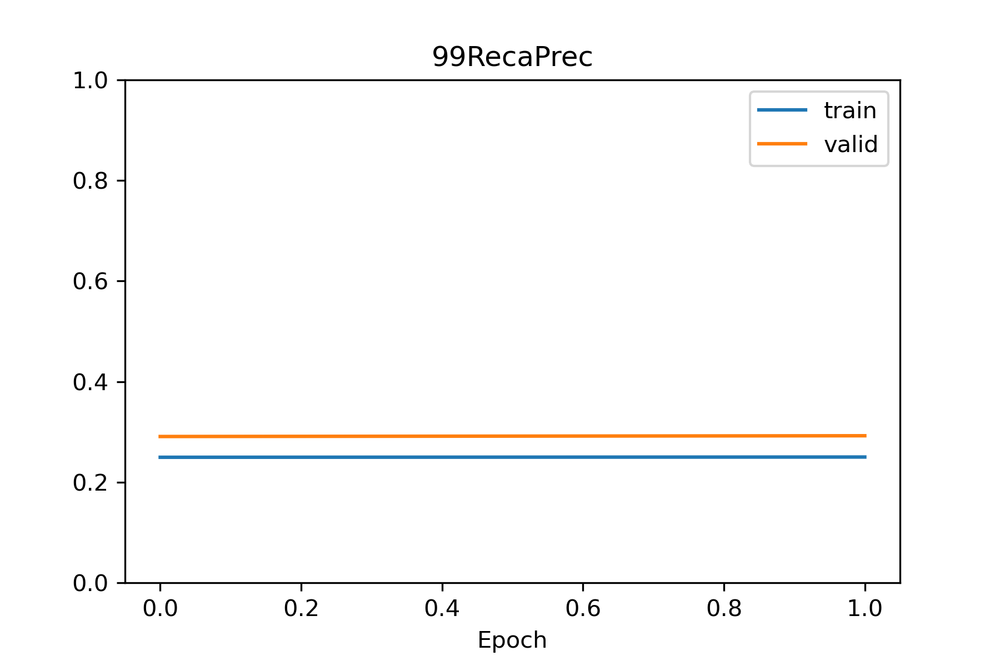

# ML-Based Marine Spill Detector


We propose an oil spill detection web application that periodically reads NASA satellite data and generates a global geographic heatmap. The purpose of the heatmap is to indicate the occurrence chance of the spillage incidents using regular deep learning methods. The proposal of the project is published in the NASA Space Apps challenge website. [Continue Reading](Proposal.md)

<br />
<br />
<br />


## Pre-Processed Data


| File  | Desc | Size | URL |
| ------------- | ------------- |------------- |------------- |
| SSS_02_metadata.csv  | Selected Data Listing | 8.64 MB | [Direct Download](https://www.dropbox.com/s/zoef50qn5rcnsdf/SSS_02_metadata.csv?dl=1) |
| SSS_02_raw.zip/time_samples.csv  | Cleaned Data Listing | 4.84 MB | [Direct Download](https://www.dropbox.com/s/oo52lhxypfvdmdb/SSS_02_raw_time_samples.csv?dl=1) |
| SSS_02_delta.zip/sample_pairs.csv  | Extracted Data Listing | 8.06 MB | [Direct Download](https://www.dropbox.com/s/24rghn8jl352cer/SSS_02_delta_sample_pairs.csv?dl=1) |
| SSS_02_raw.zip  | Cleaned Dataset  | 518.02 MB | [Direct Download](https://www.dropbox.com/s/jhz8uytpkty38n7/SSS_02_raw.zip?dl=1) |
| SSS_02_delta.zip  | Extracted Dataset  | 365.98 MB | [Direct Download](https://www.dropbox.com/s/t0diyq5y8onun77/SSS_02_delta.zip?dl=1) |

| Browse Spatial Distributions by Label | SSS_02_delta.zip Subsets by Type  |
| ------------- | ---------- |
| <a href="https://www.saudispaceshuttle.com/SSS_02"></a> |   | 
 [Explore more data details](/data)


<br />
<br />
<br />


## Training a Baseline Deep Learning Model

### 1. Prerequisites
I. [Conda Distribution of Python](https://docs.conda.io/en/latest/miniconda.html)
    
II. [GPU Version of TensorFlow](https://docs.anaconda.com/anaconda/user-guide/tasks/tensorflow/)
```
conda install -c anaconda tensorflow-gpu
```

III. [Extracted Samples of SSS_02](/data)

If you're using Linux, open the Terminal and enter:
 ```terminal
 wget "https://www.dropbox.com/s/t0diyq5y8onun77/SSS_02_delta.zip?dl=1"
 ```

### 2. Preparing Data Generators by TensorFlow

Data augmentation is a standard practice in imagery and big data and is available in the [ImageDataGenerator](https://www.tensorflow.org/api_docs/python/tf/keras/preprocessing/image/ImageDataGenerator) class.


```Python

dataset_directory = '/home/username/SSS_02_delta'
image_size = (256, 256)
batch_size = 50

import tensorflow as tf
print( tf.test.gpu_device_name() ) 
from tensorflow.keras.preprocessing.image import ImageDataGenerator

gen = ImageDataGenerator(
    rescale=1./255.,
    horizontal_flip = True,
    vertical_flip = True,
    rotation_range = 5,
    height_shift_range = 2,
    width_shift_range = 2,
)

train_generator = gen.flow_from_directory(
    dataset_directory+'/train',
    target_size = image_size,
    batch_size = batch_size,
    class_mode = 'binary',
    color_mode = 'grayscale',
)

valid_generator = ImageDataGenerator(rescale=1./255.).flow_from_directory(
    dataset_directory+'/valid',
    target_size = image_size,
    batch_size = batch_size,
    class_mode = 'binary',
    color_mode = 'grayscale',
)
```

### 3. Define and compile a Keras model


```Python

n_channels0 = 8
n_channels = 16

from tensorflow.keras.models import Sequential
from tensorflow.keras import layers
from tensorflow.keras import metrics
from tensorflow.keras.losses import BinaryCrossentropy
from tensorflow.keras.optimizers import Adam

model = Sequential(name="MarineSpillDetector001")
model.add(layers.InputLayer( input_shape=( *image_size , 1 )))

model.add(layers.BatchNormalization())
model.add(layers.Conv2D(n_channels0, (3, 3), activation='relu'))
model.add(layers.MaxPooling2D((2, 2)))
model.add(layers.Conv2D(n_channels, (3, 3), activation='relu'))
model.add(layers.MaxPooling2D((2, 2)))

model.add(layers.BatchNormalization())
model.add(layers.Conv2D(n_channels, (3, 3), activation='relu'))
model.add(layers.MaxPooling2D((2, 2)))
model.add(layers.Conv2D(n_channels, (3, 3), activation='relu'))
model.add(layers.MaxPooling2D((2, 2)))

model.add(layers.BatchNormalization())
model.add(layers.Conv2D(n_channels, (3, 3), activation='relu'))
model.add(layers.Flatten())
model.add(layers.Dense(n_channels, activation='relu'))
model.add(layers.Dense(1,activation='sigmoid'))


model.compile(optimizer='adam',
              loss = BinaryCrossentropy(),
              metrics = [
                        metrics.AUC(name="AUC"),
                        metrics.PrecisionAtRecall(.90,name="90RecaPrec"),
                        metrics.PrecisionAtRecall(.99,name="99RecaPrec"),
                        metrics.Precision(name="Prec"),
                        metrics.Recall(name="Reca"),
                      ],
             )

model.summary()

```

[output]
```
Model: "MarineSpillDetector001"
_________________________________________________________________
Layer (type)                 Output Shape              Param #   
=================================================================
batch_normalization_6 (Batch (None, 256, 256, 1)       4         
_________________________________________________________________
conv2d_10 (Conv2D)           (None, 254, 254, 8)       80        
_________________________________________________________________
max_pooling2d_8 (MaxPooling2 (None, 127, 127, 8)       0         
_________________________________________________________________
conv2d_11 (Conv2D)           (None, 125, 125, 16)      1168      
_________________________________________________________________
max_pooling2d_9 (MaxPooling2 (None, 62, 62, 16)        0         
_________________________________________________________________
batch_normalization_7 (Batch (None, 62, 62, 16)        64        
_________________________________________________________________
conv2d_12 (Conv2D)           (None, 60, 60, 16)        2320      
_________________________________________________________________
max_pooling2d_10 (MaxPooling (None, 30, 30, 16)        0         
_________________________________________________________________
conv2d_13 (Conv2D)           (None, 28, 28, 16)        2320      
_________________________________________________________________
max_pooling2d_11 (MaxPooling (None, 14, 14, 16)        0         
_________________________________________________________________
batch_normalization_8 (Batch (None, 14, 14, 16)        64        
_________________________________________________________________
conv2d_14 (Conv2D)           (None, 12, 12, 16)        2320      
_________________________________________________________________
flatten_2 (Flatten)          (None, 2304)              0         
_________________________________________________________________
dense_4 (Dense)              (None, 8)                 18440     
_________________________________________________________________
dense_5 (Dense)              (None, 1)                 9         
=================================================================
Total params: 26,789
Trainable params: 26,723
Non-trainable params: 66
_________________________________________________________________
```


### 4. Train a Deep Learning Model using Tensorflow

Define and compile a Keras model, then use the following code for the training. 

```Python

epochs = 2
verbose = 1
class_0_weight = .33

history = model.fit(  
        train_generator,
        steps_per_epoch=int(train_generator.samples/train_generator.batch_size),
        epochs = epochs,
        validation_data=valid_generator,
        validation_steps=int(valid_generator.samples/valid_generator.batch_size),
        class_weight = {  0 : class_0_weight , 
                          1 : 1. },
        verbose = verbose,
)
```

[output]
```
Epoch 1/2
642/642 [==============================] - 195s 289ms/step - loss: 0.3438 - AUC: 0.5399 - 90RecaPrec: 0.2494 - 99RecaPrec: 0.2461 - Prec: 0.2776 - Reca: 0.4239 - val_loss: 0.6699 - val_AUC: 0.5826 - val_90RecaPrec: 0.2918 - val_99RecaPrec: 0.2908 - val_Prec: 0.3586 - val_Reca: 0.5005
Epoch 2/2
642/642 [==============================] - 176s 274ms/step - loss: 0.3393 - AUC: 0.5957 - 90RecaPrec: 0.2608 - 99RecaPrec: 0.2503 - Prec: 0.3151 - Reca: 0.5748 - val_loss: 0.6417 - val_AUC: 0.6079 - val_90RecaPrec: 0.3116 - val_99RecaPrec: 0.2924 - val_Prec: 0.3559 - val_Reca: 0.5159
```

<br />
<br />
<br />


## Preliminary Results

### 1. Area Under the Curve (AUC)


### 2. Precision At 99% Recall



### 3. Precision At 90% Recall


### 4. Training Progress

#### Recall


#### Precision


#### Binary Cross-Entropy Loss


<br />
<br />
<br />


